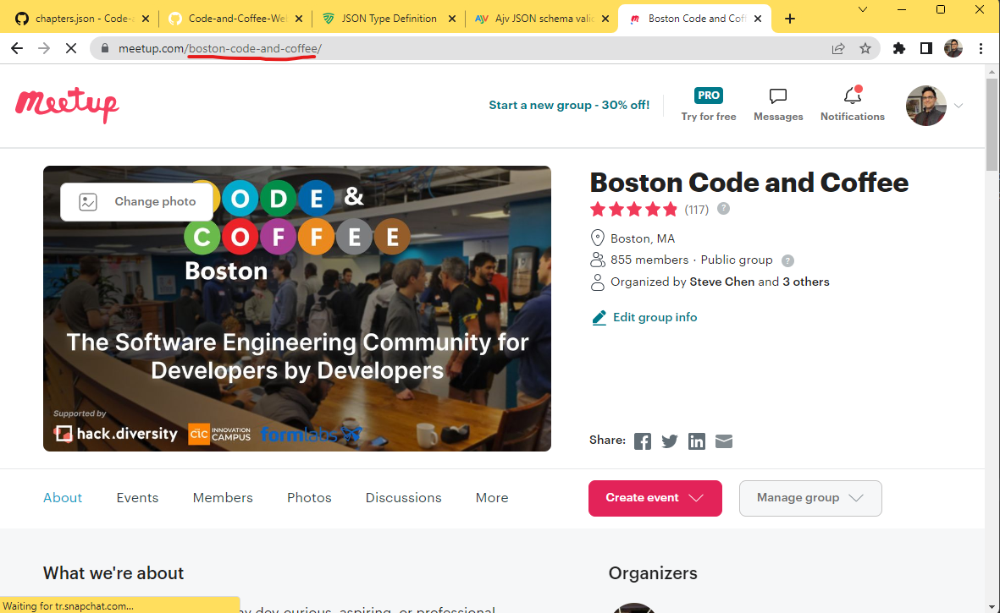

# Settings

Following are descriptions for all the settings that can be configured for the Code and Coffee Service.

## [Chapters](./chapters.json)

**chapters.json**

A list of all the active Code and Coffee chapters. The name is a casual name to use as reference for the chapters for organizational purposes. The display name for a chapter should be taken from Meetup.com. meetupGroupUrlName is the chapter's Meetup group's url name. You can find it by navigating to the group's page in the url bar. This is used to fetch information for the group from Meetup.

## [Chapter Icons](./chapter-icons)

**chapter-icons**
  
The icons to use for each individual chapter. The icons must be relatively small and in png format. The name of the file must match the chapter's meetup url name to be discovered.

## [Notifications](./notifications.json)

**notifications.json**

Manages notifications that are sent to Github as issues and emails of relevant folks.