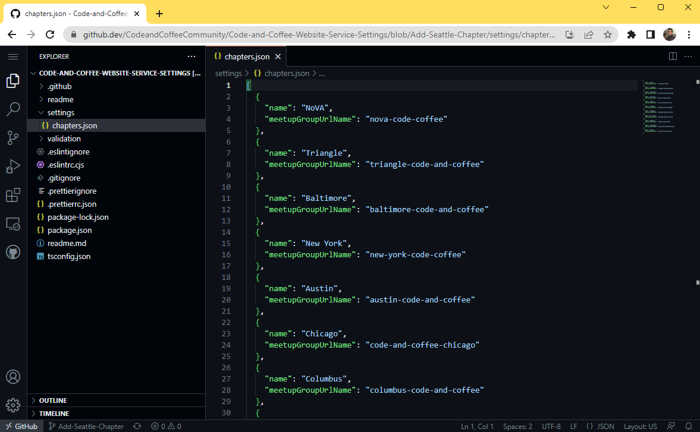

# Updating Settings Workflow

To update the settings you need to open a branch, make changes to that branch, then open a pull request to pull those changes into an environment.

To get started first you need to open a branch. Start by selecting branches.

Then select new branch.

Give your branch a name then select Create Branch (Keep an eye on what branch you are branching off of)

  

Now navigate to the settings file you are interested in updating. When there, make sure you are on your new branch, then enter the editor by pressing "." on your keyboard.  

  

While in the editor you can edit your file. Update the settings file to whatever you need.

  
  

When you are done making changes, select the GIT tab on the left side of the screen to open up the GIT menu. When there, add a name for your change, then select Commit and Push.  

  

After you push your commit return back to the github repo. From there open the pull request tab. In the pull request tab select New Pull Request.  

  

Now select the environment on the left you want the changes to reflect, and the branch you made changes to on the right. After that, select Open Pull Request.  

  

You can now add some comments if you like, when you are satisfied, select Create Pull Request.  

  

You should now be greeted with the pull request page. If at the bottom of the page you see an orange circle, the validations of your settings are currently running. Wait until the validation is complete.  

  

After the Validations are complete, if you are greeted with a red circle, the validations have failed and the settings have been configured incorrectly. To see what might be wrong you can select details to bring you through the log messages about the validation failure.  

  
  

If you are greeted with a green circle, the validations have passed and the settings have been configured correctly. You can now hit the merge button to merge your settings. You will be granted with a confirmation page, select confirm merge. You should then be greeted with a merge confirmed page.

Your settings are now live. Once the cache refreshed (approximately 5 minutes or so) you should see the changes reflected in the environment.  

